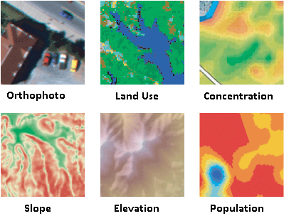

---
tags:
  - techniques-short-course
  - new-urban-analytics
  - teaching
  - slides
output:
  xaringan::moon_reader:
    css: [metropolis, metropolis-fonts,"nkaza-pres.css"]
    lib_dir: libs
    nature:
      highlightStyle: github
      highlightLines: true
      countIncrementalSlides: false
      seal: false
---

class: right, bottom
```{r setup, include=FALSE}
options(htmltools.dir.version = FALSE)
knitr::opts_chunk$set(fig.width=12, fig.height=8, fig.path='figs/', echo=TRUE, warning=FALSE, message=FALSE)
library(RefManageR)
bib <- ReadBib("~/Dropbox/Public/master.bib")
myopts <- BibOptions(bib.style = "authoryear", style="markdown", first.inits=FALSE, max.names = 3)
library(printr)
library(tidyverse)
library(kableExtra)
```
## Raster data in R 

##### Nikhil Kaza
##### Department of City & Regional Planning <br /> University of North Carolina at Chapel Hill
###### updated: `r Sys.Date()`

---
# Fields vs. Objects

This is an age old debate as to which is a better representation of reality.

Objects: Discrete, sharply defined boundaries, have distinct attributes (e.g. buildings, roads, parcels, census tracts)
  - Need to keep track of topology and spatial relations among them

Fields: Something that varies continuously over space. The discretisation is an artefact of the data storage and representation (e.g. temperature, ground level, urbanicity)
  - Topological relationships are embedded 
 
Usually fields are represented by rasters. Rasters could be thought of as a 2D-matrix of values, with row and column indices representing the location information.
---

# Raster data in urban analytics

.pull-left[
- Satellite images

- Ground level pictures

- Airborne sensors

- Radar
]

.pull-right[

[Image Credit: ESRI](https://developers.arcgis.com/net/latest/uwp/guide/add-raster-data.htm)
]

---

# Raster package

In this course we will use Robert Hijmans' excellent Raster package. This package handles raster data that does not fit into memory.

```{r message=FALSE}
if(!require(raster)){
    install.packages("raster")
   {{ library(raster) }}
}

(rast <- raster())

```

---

```{r}

res(rast) <- 20
rast
ncol(rast) <- 30
 rast
```
---

# External Files

```{r}
rast <- raster(system.file("external/test.grd", package="raster"))
library(rasterVis)
levelplot(rast, xlab=NULL, ylab=NULL, scales=list(draw=FALSE), margin=FALSE,  colorkey= list(labels=list(cex=2.5)))

```
See [https://oscarperpinan.github.io/rastervis/#levelplot](https://oscarperpinan.github.io/rastervis/#levelplot)
---

# Rasters can be stacked

```{r}
rast2 <- rast * runif(ncell(rast)) 
(rastS <- stack(rast, rast2))

```
---

# or bricked

```{r}
rastB <- brick(rast, rast2)
names(rastB) <- c('Original', 'Modified')
levelplot(rastB, xlab=NULL, ylab=NULL, scales=list(draw=FALSE), margin=FALSE,  colorkey= list(labels=list(cex=2.5)))


```
---

# Cell by cell algebra

Standard mathematical operators +,- etc. or logical operators such as $\ge$, $\max$ etc.. work cell by cell between multiple Raster* objects or between Raster and numbers

```{r}
rastB[[1]] <- rast * 10
(rastB)
```

---
# Cell by cell algebra
More complicated algebra is possible

```{r out.width = "60%"}
(rastB[[1]]/100 >= rastB[[2]]) %>%
  levelplot(xlab=NULL, ylab=NULL, scales=list(draw=FALSE), margin=FALSE,  colorkey= list(labels=list(cex=2.5)))
```

---
# Moving window
```{r}
# 3x3 mean filter
(rast3 <- focal(rast, w=matrix(1/9,nrow=3,ncol=3)) )
```
---

# Moving window

```{r out.width = "70%"}
# Local maximum in 5X5 neighborhood
rast3 <- focal(rast, w=matrix(1, nrow=5,ncol=5), fun=max, na.rm=TRUE)
res(rast3)
levelplot(rast3,xlab=NULL, ylab=NULL, scales=list(draw=FALSE), margin=FALSE,  colorkey= list(labels=list(cex=2.5)))
```
---

# Reduce resolution
```{r out.width = "70%"}
rast3 <- rast %>% aggregate(fact=5,fun=mean) 
res(rast3)
levelplot(rast3, xlab=NULL, ylab=NULL, scales=list(draw=FALSE), margin=FALSE,  colorkey= list(labels=list(cex=2.5)))


```

---

# Categorical raster
```{r }
rastCat <- rast %>% cut(breaks=c(0,300,800,1100, 1900))
rastCat <- ratify(rastCat)
rat <- levels(rastCat)[[1]]
rat$class <- c('Low', 'Mid', 'High', 'V. High')
```
```{r echo=FALSE, out.width="60%"}

levels(rastCat) <- rat
library(RColorBrewer)
(p <- levelplot(rastCat, 
          xlab=NULL, ylab=NULL,
          scales=list(draw=FALSE),
          col.regions=brewer.pal(n=length(rat$class), name='Dark2'), 
          colorkey= list(labels=list(cex=2.5))))
```

---

# Vector/Raster Operations

```{r}
cds1 <- structure(c(179169.418312112, 179776.022915626, 179344.40040928, 
179064.429053812, 178737.795805766, 179076.094526956, 178726.130332621, 
179169.418312112, 330830.748571234, 330527.446269478, 330049.161870553, 
329955.838085397, 330037.496397409, 330247.47491401, 330387.460591744, 
330830.748571234), .Dim = c(8L, 2L))

cds2 <- structure(c(180440.954884862, 180522.613196873, 179857.681227637, 
179951.005012793, 180440.954884862, 332417.252918885, 331717.324530216, 
331554.007906193, 331962.29946625, 332417.252918885), .Dim = c(5L, 
2L))

polys <- SpatialPolygonsDataFrame(SpatialPolygons(list(Polygons(list(Polygon(cds1)), 1), 
                                  Polygons(list(Polygon(cds2)), 2))),data.frame(ID=c(1,2)))

polys
```
---

# Vector/Raster Operations

```{r}
p + layer(sp.polygons(polys, lwd=4, col='blue'))
```

---
# Count percentage of cells

```{r}
library(tabularaster)
cn <- cellnumbers(rastCat, polys)
library(dplyr)
(cn %>% mutate(v = raster::extract(rastCat, cell_)) %>% 
    group_by(object_, v) %>% 
    summarize(count = n()) %>% 
  mutate(v.pct = count / sum(count))
  )


```
---

# Least cost path between two points

```{r out.width='70%'}
library(gdistance)
# Construct cells that are `impasssable`
cost <- calc(rast, fun=function(x)  ifelse(x > 400 & x<900, NA,  x)) #toy example
rclmat <- c(0,200, 20, 200, 400, 30, 900,1900, 40) %>% matrix(ncol=3, byrow = TRUE)
cost <- reclassify(cost, rclmat  )
A <- c(179706.2, 330570.0)
B <- c(180100.9, 331074.3)
plot(cost)
```

---

```{r out.width='60%'}
# Least cost path between two points

conductance <- transition(cost, function(x) 1/mean(x), 8) # Conductance matrix
AtoB <- shortestPath(conductance, A, B, output="SpatialLines")
plot(cost)
lines(AtoB, col="red", lwd=2)

```

---
class: center, middle

Slides created via the R package [**xaringan**](https://github.com/yihui/xaringan).

The chakra comes from [remark.js](https://remarkjs.com), [**knitr**](http://yihui.name/knitr), and [R Markdown](https://rmarkdown.rstudio.com).
