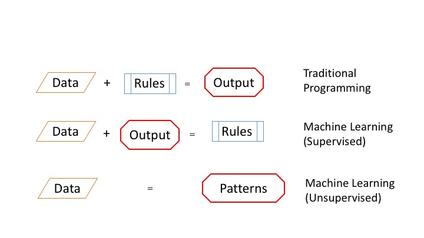
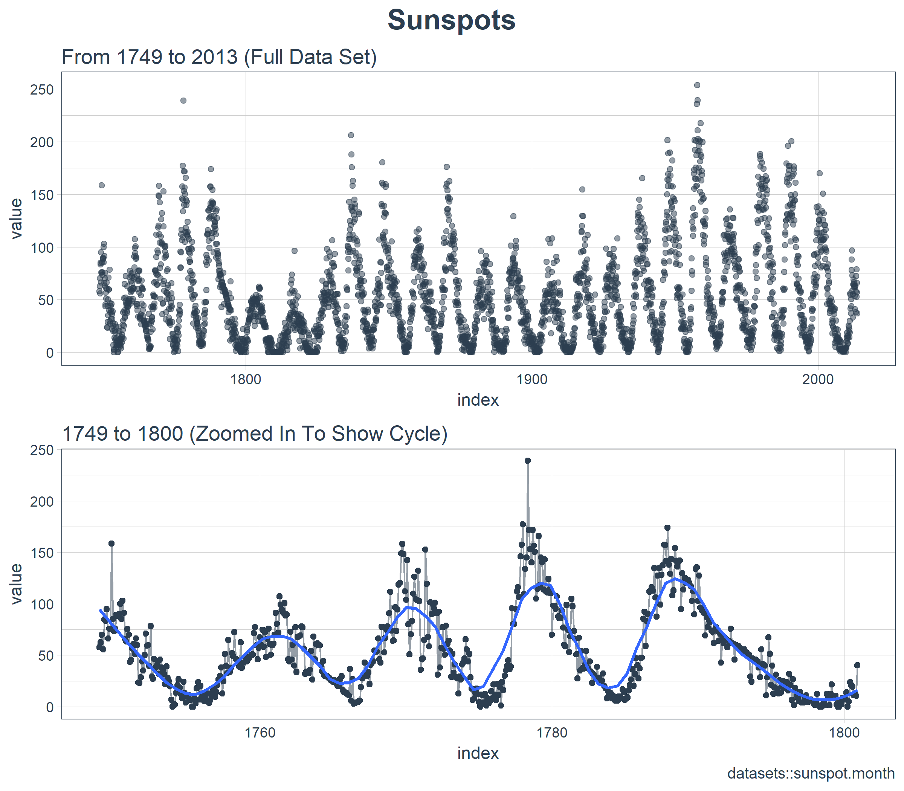
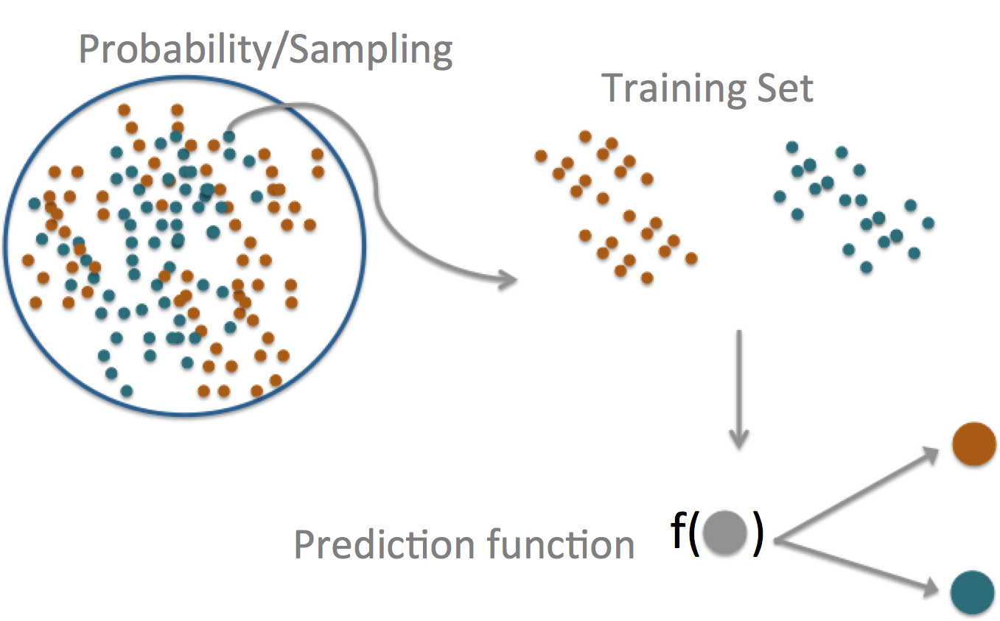

class: right, bottom

```{r setup, include=FALSE}

options(htmltools.dir.version = FALSE)
knitr::opts_chunk$set(fig.width=12, fig.height=8, fig.path='figs/', echo=TRUE, warning=FALSE, message=FALSE)
library(RefManageR)
bib <- ReadBib("~/Dropbox/Public/master_2.bib")
myopts <- BibOptions(bib.style = "authoryear", style="markdown", first.inits=FALSE, max.names = 3)
library(printr)
library(tidyverse)
library(kableExtra)
```

## Machine Learning for Urban Analytics

##### Nikhil Kaza
##### Department of City & Regional Planning <br /> University of North Carolina at Chapel Hill
###### updated: `r Sys.Date()`


---
# What is Machine Learning ?

```{r echo=F}

```

---

# The purpose of Machine Learning

* Mostly for Prediction...
    - Classification (Categories of objects e.g. spam/not spam; median strip /side walk/road, default/ prepayment / Current)
   - Regression (Continous variables, e.g. volume of water consumption/ energy use )
      - Not the same as statistical inference such as linear regression.
 
 ### OK. What kinds of prediction?
 
- Local governments: Traffic congestion
- Google: What ads to show
- Amazon: What products to buy
- Insurance: Risk based on prior claims
- UNC: Sakai use to identify students in need of intervention.

---

# Different Terms

- Prediction
- Projection
- Forecast
- Scenarios

## What do you think the differences are? 

```{r echo=F}

```

---

# The central dogma of prediction

```{r echo=FALSE}

```


---
class: right, bottom, inverse

## Following SPAM slides are all from Jeff Leek @ Johns Hopkins University

---

# Components of a predictor

</br>

<center> question -> input data -> features -> algorithm -> parameters -> evaluation  </center>


---

# SPAM Example

</br>

<center> <redtext>question</redtext> -> input data -> features -> algorithm -> parameters -> evaluation  </center>

</br>

__Start with a general question__

Can I automatically detect emails that are SPAM that are not?

__Make it concrete__

Can I use quantitative characteristics of the emails to classify them as SPAM/HAM?


---

# SPAM Example

</br>

<center> question -> <redtext>input data </redtext> -> features -> algorithm -> parameters -> evaluation  </center>


[http://rss.acs.unt.edu/Rdoc/library/kernlab/html/spam.html](http://rss.acs.unt.edu/Rdoc/library/kernlab/html/spam.html)


---

# SPAM Example

</br>

<center> question -> input data  -> <redtext>features</redtext> -> algorithm -> parameters -> evaluation  </center>

</br>


<b>
Dear Jeff, 

Can you send me your address so I can send you the invitation? 

Thanks,

Ben
</b>


---

# SPAM Example

</br>

<center> question -> input data  -> <redtext>features</redtext> -> algorithm -> parameters -> evaluation  </center>

</br>

<b> 

Dear Jeff, 

Can <rt>you</rt> send me your address so I can send <rt>you</rt> the invitation? 

Thanks,

Ben
</b>

</br>

Frequency of you $= 2/17 = 0.118$

---

# SPAM Example

</br>

<center> question -> input data  -> <redtext>features</redtext> -> algorithm -> parameters -> evaluation  </center>


```{r loadData}
library(kernlab)
data(spam)
str(spam)

```

---

# SPAM Example

```{r}
table(spam$type)
```


---

# SPAM Example


<center> question -> input data  -> features -> <redtext>algorithm</redtext> -> parameters -> evaluation  </center>

```{r,dependson="loadData",fig.height=6,fig.width=6}
plot(density(spam$your[spam$type=="nonspam"]),
     col="blue",main="",xlab="Frequency of 'your'")
lines(density(spam$your[spam$type=="spam"]),col="red")
```

---

# SPAM Example


<center> question -> input data  -> features -> <redtext>algorithm</redtext> -> parameters -> evaluation  </center>

</br></br>

__Our algorithm__

* Find a value $C$. 
* __frequency of 'your' $>$ C__ predict "spam"

---

# SPAM Example


<center> question -> input data  -> features -> algorithm -> <redtext>parameters</redtext> -> evaluation  </center>

```{r,dependson="loadData",fig.height=6,fig.width=6}
plot(density(spam$your[spam$type=="nonspam"]),
     col="blue",main="",xlab="Frequency of 'your'")
lines(density(spam$your[spam$type=="spam"]),col="red")
abline(v=0.5,col="black")
```

---

# SPAM Example


<center> question -> input data  -> features -> algorithm -> parameters -> <redtext>evaluation</redtext></center>

```{r,dependson="loadData",fig.height=6,fig.width=6}
prediction <- ifelse(spam$your > 0.5,"spam","nonspam")
table(prediction,spam$type)/length(spam$type)
```

Accuracy $\approx 0.459 + 0.292 = 0.751$

---
class: right, bottom, inverse

## End Jeff Leek's slides

---

# Bike Sharing 

- General Q: Can you predict which stations will need to be restocked with bikes at different times of the day? 
   - How can you use neighborhood characterstics (demographics, economics, proxmity to other stations) and time of day, day of the week, season, weather etc. to predict number of open slots on bike stations?


---

# Urban Sprawl & Environmental Impacts

- General Q: Can you predict number of bad air quality days from urban form characteristics?
   - Can urban landscape metrics and other demographic characteristics predict bad air quality days in a year?
   


---

# Urban Form & Healthy Behaviours

- General Q: How does urban form characteristics relate to healthy outcomes? 
   - How does street density, intersection density, activity density etc. impact residents' healthy behaviours (healthy food consumption, exercise etc.)?
   


---

# Energy Conservation & Mortgage Risks

- General Q: Should we reward households with conservation proclivities with a break on mortgage interest rates?
   - Is the choice to buy energy star appliances and houses in infill urban areas correlated with lower default/prepayment rate?
   


---

# Mode Choice

- General Q: Can we predict household transportation mode choice?
   - Given the weather, cost of travel, cost of parking etc. what is the likelihood that a household will choose to drive vs. taking public transit.
   


---

# Experimental Design


---
class: inverse, right, bottom

# Models briefly explained

---

# K Nearest Neighbor


.footnote[ https://en.wikipedia.org/wiki/K-nearest_neighbors_algorithm]
---

# Logistic Regression (Misnomer)


.footnote[http://dataaspirant.com/2017/03/02/how-logistic-regression-model-works/]

---

# Trees


.footnote[https://www.techemergence.com/what-is-machine-learning/]


---

# Trees


.footnote[https://nyti.ms/2QRnQxI]

---


# Forests (Ensembles)


.footnote[http://www.robots.ox.ac.uk/~az/lectures/ml/lect5.pdf]

---

# And lots more...


---

class: right, bottom, inverse

## Some Terminology

---

# Ensembling


.footnote[https://quantdare.com/what-is-the-difference-between-bagging-and-boosting/]

---

# Bootstrap aggregating (bagging)

1. Resample cases and recalculate predictions
2. Average or majority vote


.footnote[
```{r echo=FALSE, results='asis'}
bib[c('downscalingprecipitation:2016')]
```
]

---

# Boosting

1. Create a model
2. Focus on the errors of the model and create another model
3. Continue this process until no improvement occurs


.footnote[https://blog.bigml.com/2017/03/14/introduction-to-boosted-trees/]

---
# Boosting Explained


.footnote[https://medium.com/mlreview/gradient-boosting-from-scratch-1e317ae4587d]

---
# Boosting Explained


.footnote[https://medium.com/mlreview/gradient-boosting-from-scratch-1e317ae4587d]

---
## Basic terms

In general, __Positive__ = identified and __negative__ = rejected. Therefore:

__True positive__ (TP) = correctly identified (e.g. Real buildings identified as buildings by the model.)

__False positive__ (FP) = incorrectly identified (e.g. Real non-buildings identified as buildings)

__True negative__ (TN) = correctly rejected (e.g. Real non-buildings identified as non-buildings by the model)

__False negative__ (FN) = incorrectly rejected (e.g. Real buildings identified as roads by the model)


[http://en.wikipedia.org/wiki/Sensitivity_and_specificity](http://en.wikipedia.org/wiki/Sensitivity_and_specificity)


---
# Accuracy Metrics

1. Mean squared error (or root mean squared error)
  * Continuous data, sensitive to outliers
2. Median absolute deviation 
  * Continuous data, often more robust
3. Sensitivity (recall): $TP/(TP+FN)$
  * If you want few missed positives (e.g. identify as many buildings as possible, even if you misidentify some non-buildings as buildings)
4. Specificity: $TN/(TN+FP)$
  * If you want few negatives called positives (e.g. identify more buildings correctly, even if you miss some true buildings )
5. Accuracy $(TP+TN)/(TP + TN + FP + FN)$
  * Weights false positives/negatives equally
6. Concordance
  * One example is [kappa](http://en.wikipedia.org/wiki/Cohen%27s_kappa)
7. Predictive value of a positive (precision): $TP/(TP +FP)$
  * When the prevalance is low (e.g. identify a rare class of a 'tent city' in US cities)
  
---
# Conclusion


---
# Practical Advice

- Focus on the importance of the problem
- Try simple models first
- Much of machine learning is about trying to create good features (variables); Models are secondary
- Scale the features to have similar values (sale price in millions, sq.ft in 1000s don't work well)
- Ideally you want these features to be minimally correlated
- Some algorithms requires lots of training data. Focus on creating good labelled data. Share it with others

