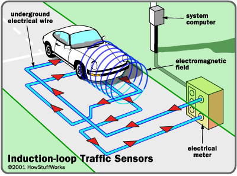
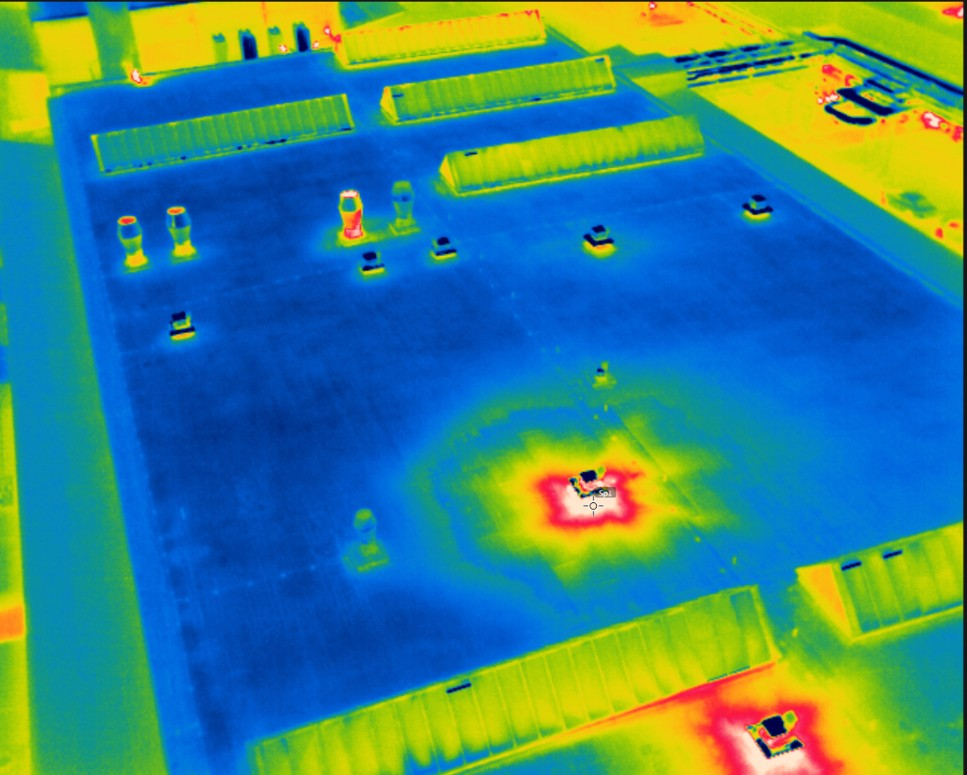
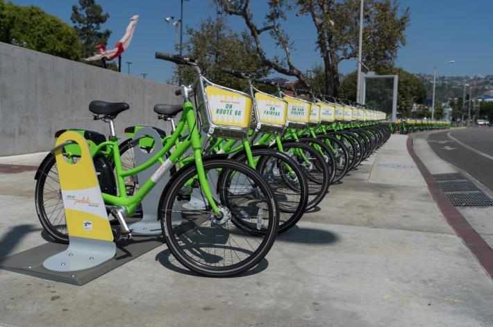
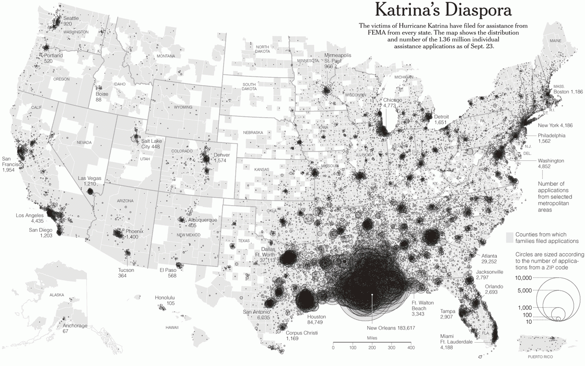
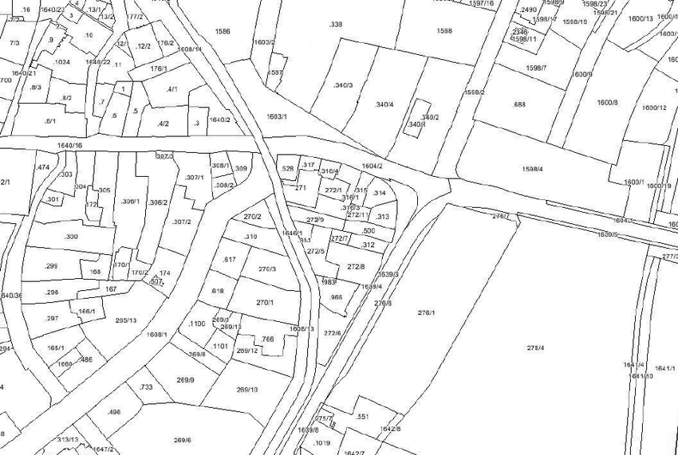
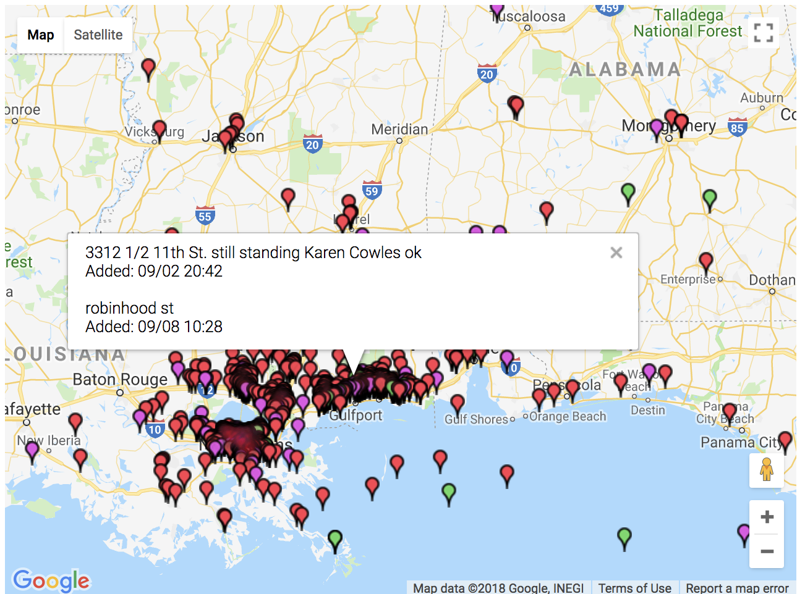
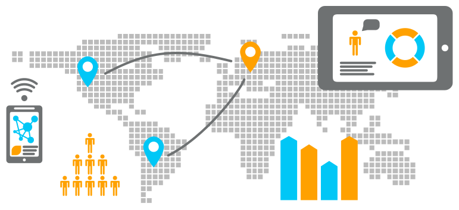

---
tags:
  - techniques-short-course
  - urban-analytics
  - teaching
  - slides
output:
  xaringan::moon_reader:
    css: [metropolis, metropolis-fonts,"../nkaza-pres.css"]
    lib_dir: libs
    nature:
      highlightStyle: github
      highlightLines: true
      countIncrementalSlides: false
      seal: false
---

class: right, bottom
```{r setup, include=FALSE}
options(htmltools.dir.version = FALSE)
library(RefManageR)
bib <- ReadBib("~/Dropbox/Public/master.bib")
myopts <- BibOptions(bib.style = "authoryear", style="markdown", first.inits=FALSE, max.names = 3)
library(printr)
library(tidyverse)
library(kableExtra)
```
## Data & Cities

##### Nikhil Kaza
##### Department of City & Regional Planning <br /> University of North Carolina at Chapel Hill
###### updated: `r Sys.Date()`
---

# Objectives


- New forms of technology are increasingly embedded into city systems 

--

- Ways to think about analysing messy datasets that are generated by these sensors

--

- Fusing administrative and volunteered information to frame and solve urban problems

--

- Critically analysing the problems and institutions of data generation & pitfalls of analysis
--

- Exploratory Data Analysis and Visualisation in R

--

**Data in service of a compelling argument**


---

class:inverse, middle, center

# Issues 
---

# Urban Analytics

The multi-disciplinary area of research concerned with using new and emerging forms of data, alongside computational, visualisation and statistical techniques, to study cities and their systems, tell stories and understand their issues.

It is imperative to be critical of these techniques & procedures 

--

> “The problem with data is that it says a lot, but it also says nothing. ‘Big data’ is terrific, but it’s usually thin. To understand why something is happening, we have to engage in both forensics and guess work."
> --Sendhil Mullainathan

--

The question is not really about what to do about and with the data. The fundamental questions are

- What can we know that we could not before?
- What can we be more certain of? What are we more uncertain about?
- **How, where and why can/should we act?**

---

# (Big/Biggish) Data


---

# Urban data characteristics

```{r echo=FALSE, results='asis'}
library(tidyverse)
read.csv('./figs/Bigdata_4vs.csv') %>%
  kable() %>%
  kable_styling()


```
---

# Types of data

.pull-left[
## Stationay Sensor Networks
## Advanced Metering Infrastructure
]

.pull-right[


]

---

# Types of data

.pull-left[
## Airborne Sensors (Drones/Satellites)]

.pull-right[
]


---

# Types of data

.pull-left[
## Transactions]

.pull-right[


]


---

# Types of data

.pull-left[
## Administrative data
]

.pull-right[


]

---
# Types of data

.pull-left[
## (in)Volunteered information
- GPS traces
- Consumer Data Harvesting
]


.pull-right[


]

---
# Types of data

.pull-left[
##  Unstructured data
- Text
- Images
- Tweets
- Blogs
- Complaints
- Audio
]
.pull-right[ 

]

---
# Types of data

.pull-left[
##  Real time video
]

<iframe width="1360" height="765" src="https://www.youtube.com/embed/K-F4CeVsWHA?ecver=1" frameborder="0" allow="autoplay; encrypted-media" allowfullscreen></iframe>


---
# Types of data

.pull-left[
##  Old fashioned Big Data
- Census
- Economic Surveys
- Climatic Data
- Geospatial Data from Geological Survey etc.
]

.pull-right[ 

]

---

# Eight Critiques of Data Driven Urbanism<sup>*</sup>

1. City as a knowable, rational, steerable machine 
1. Objective, neutral, non- ideological approach
1. Technocratic governance and solutionism
1. Neoliberal political economy
1. Ahistorical, aspatial, homogenizing and bounded
1. Reinforce power geometries & inequalities
1. Profound social, political, ethical effects
1. Buggy, brittle, hackable

.footnote[[*] see
```{r echo=FALSE, results='asis'}
bib[c("kitchinEthicsSmartCities2016", "Kitchin2014")]
```
]

???

1. 
   - Cities are understood to consist of a set of knowable and manageable systems that act in largely rational, mechanical, linear and hierarchical ways and can be steered and controlled 
   - Operational governance performed using a set of mechanistic data levers underpinned by an instrumental rationality in the form of Key Performance Indicators (KPI) and analytics 
   - Includes forms of automated management (automatic, autonomous, automated) • Driving new forms of new managerialism 
   - Cities are fluid, open, complex, multi- level, contingent and relational systems
2. 
    - Smart city solutions are technical, objective and non-ideological 
    - Presents an image of being politically benign and commonsensical 
    - However, systems do not exist independently of the ideas, techniques, technologies, people and contexts that conceive, produce, process, manage, analyse and store them 
    - They are situated, contingent, relational, and framed and used contextually to try and achieve certain aims and goals
    - They also possess a number of technical and managerial issues concerning design, measurement, processing – e.g., with respect to data sampling, handling, veracity (accuracy, fidelity), uncertainty, error, bias, reliability, calibration, lineage
    
3. 
    - All aspects of a city can be treated as technical problems and solved through technical approaches 
    - Practices ‘solutionism’: complex open systems can be disassembled into neatly defined problems that can be fixed or optimized through computation • All that is required is sufficient data and suitable algorithms 
    - Undermines/replaces other forms of knowing cities, plus phronesis (knowledge derived from practice and deliberation) and metis (knowledge based on experience) 
    - Marginalizes other forms of governance and solutions

4. 
    - Overly driven by corporations interested capturing government functions as new market opportunities 
    - Promoting the marketisation of public services and the hollowing out of the state 
    - City functions are administered for profit 
    - Potentially creates technological lock-ins or corporate path dependencies
5. 
    -  One size fits all approach  
    - Treats cities as a generic market 
    - Treats cities as if bounded entities
    - Fails to recognize history, culture, context, local sense of place, politics, governance, diversity, etc.. 
    - Fails to recognize interdependencies across space
6.
    - Reinforce power geometries & inequalities 
    - Smart cities/solutions are the vision of certain vested interests 
    - They serve the interests of certain constituencies 
    - They control/regulate populations 
    - Actively marginalize/dispossess some
    
7.
    - Surveillance and erosion privacy (in its diverse forms) 
    - Ownership, control, data markets 
    - Social sorting 
    - Nudge 
    - Dynamic pricing 
    - Data security 
    - Control creep
    - Tracking
8.
    - Intertwines two open, highly complex and contingent systems - cities and digital systems 
    - Creates environments which are inherently buggy and brittle; prone to viruses, glitches, crashes, and security hacks     - Producing stable, robust and secure devices and infrastructures becomes more of a challenge
    - New systems lead to the discontinuation of analogue alternatives — no alternatives until the system is fixed/rebooted

---
# Additional critiques

Planners are not trained in analysis of novel data systems

No capacity for smaller organisation to maintain systems and analyse data

No critical evaluation of politics and institutions that demand instrumented city

Little imagination of how property relations are configured in data-rich environments

---
class: center, middle

Slides created via the R package [**xaringan**](https://github.com/yihui/xaringan).

The chakra comes from [remark.js](https://remarkjs.com), [**knitr**](http://yihui.name/knitr), and [R Markdown](https://rmarkdown.rstudio.com).
